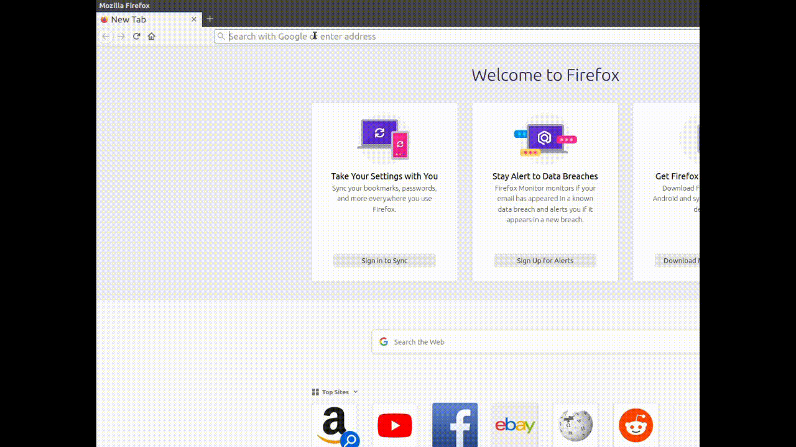

# URL Alias - Browser Extension
This extension allows users to define aliases for urls in order to access web pages faster.

## Support
* Firefox Desktop https://addons.mozilla.org/en-US/firefox/addon/alias-url/    
* Firefox for Android (including Beta Version) 
* Chrome 

## Demo

### Adding an alias from the address bar button:


### Adding an alias from the website:


## Setup
Install:
* [webextension-polyfill](https://github.com/mozilla/webextension-polyfill) for cross-browser support
* bootstrap
* jquery
```bash
npm install
```

