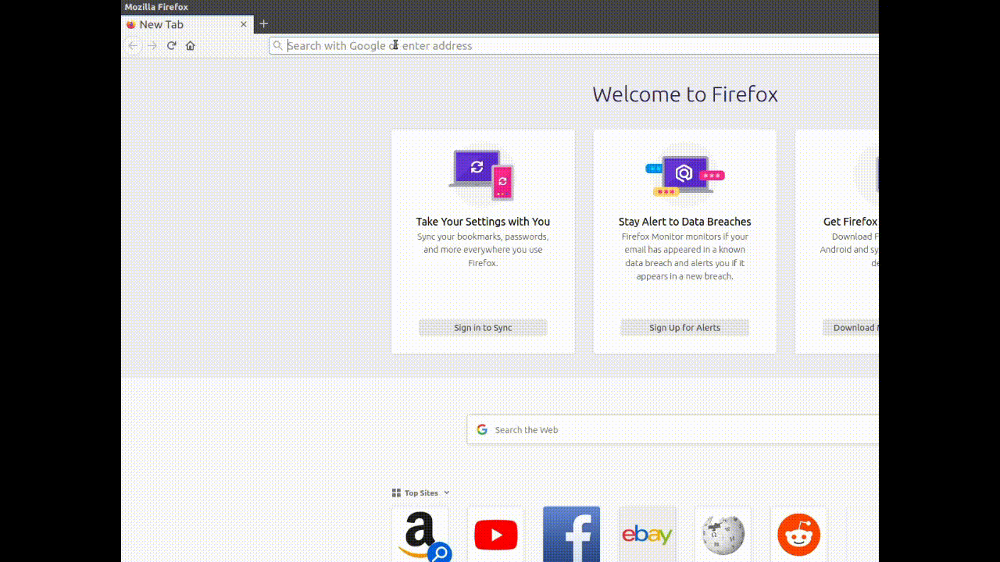

# URL Alias
This extension allows users to define aliases for urls in order to access web pages faster.

## Demo

### Adding an alias from the address bar button:

### Adding an alias from the website:

## Support
* Firefox
